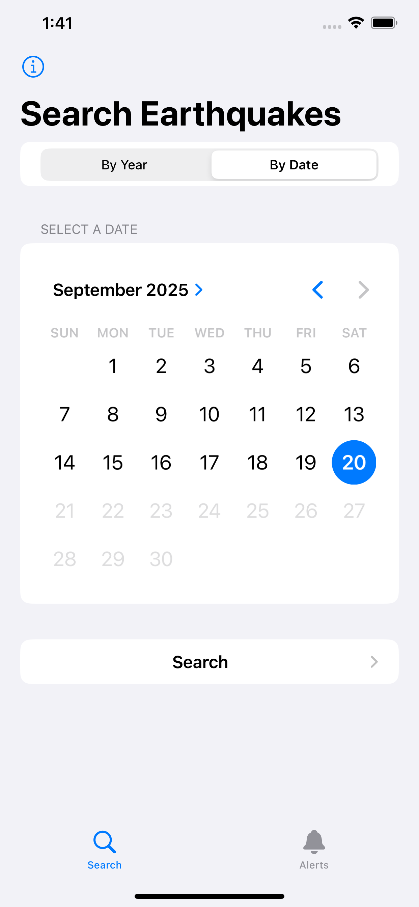
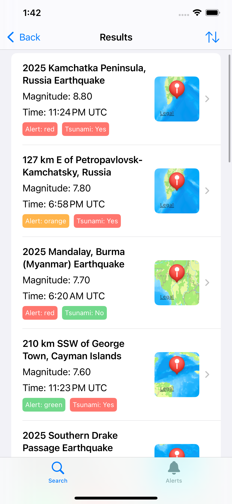
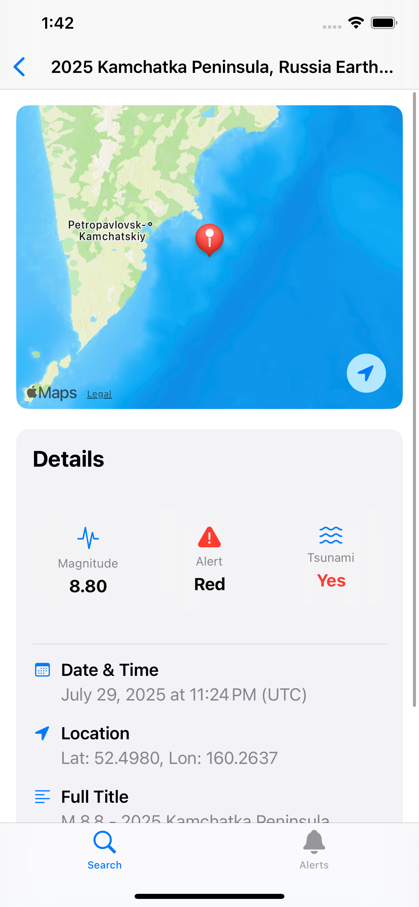
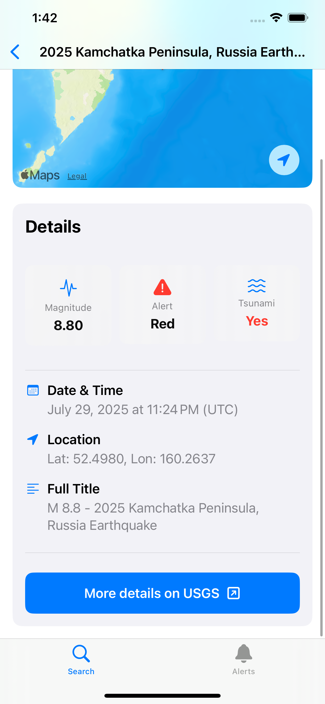
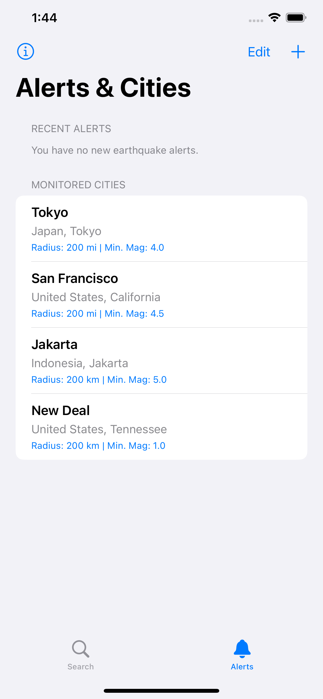
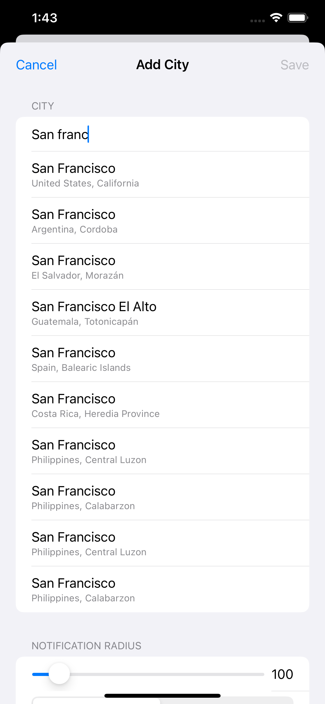

# QuakeTrack — Track Earthquakes Across The Globe!

<p align="center">
  
</p>

<p align="center">
  <strong>Your personal seismic station, monitoring the world beneath your feet!</strong>
</p>

<p align="center">
  
  
  
</p>

---

## Screenshots

<table>
  <tr>
    <td width="50%" align="center">
      <b>Search earthquakes on any date!</b><br>
      
    </td>
    <td width="50%" align="center">
      <b>See key details in the results</b><br>
      
    </td>
  </tr>
  <tr>
    <td width="50%" align="center">
      <b>View in-depth information</b><br>
      
    </td>
    <td width="50%" align="center">
      <b>Link directly to the USGS page</b><br>
      
    </td>
  </tr>
  <tr>
    <td width="50%" align="center">
      <b>Set global alerts with custom thresholds</b><br>
      
    </td>
    <td width="50%" align="center">
      <b>Autocomplete helps you find cities fast!</b><br>
      
    </td>
  </tr>
</table>

## License

MIT license (see `LICENSE` file at the root of the repo)

## Purpose of the App

QuakeTrack is a mobile application with two primary functions:

1. **Earthquake Search**: Users can browse historical earthquake data from the USGS feed, searching either by a specific year or a particular date.

2. **Custom Alerts**: Users can register one or more cities around the world to monitor. The app's backend will periodically check for seismic activity and send a push notification to the user if an earthquake occurs within a specified radius and above a certain magnitude for any of their monitored locations.

## Directory Structure

This repository is a "monorepo" containing both the frontend and backend code, organized as follows:

```
QuakeTrack/
├── ios/
│   ├── QuakeTrack/          # Main Swift source code for the iOS app
│   ├── QuakeTrack.xcodeproj/  # Xcode project file
│   └── ...                  # Other Xcode and asset files
│
└── backend/
    ├── main.py              # Python source for all Cloud Functions
    └── requirements.txt     # Python library dependencies
```

* **`ios/`**: Contains the complete source code and project files for the native SwiftUI application that runs on the user's iPhone.

* **`backend/`**: Contains the serverless Python code that is deployed to Google Cloud Platform to power the app's notification system.

## High-Level Architecture

QuakeTrack uses a modern, serverless, client-server architecture. The iOS app acts as the client, and the backend is composed of several managed services within Google Cloud Platform (GCP) and Firebase.

### **1. iOS App (Frontend)**

The client is a native iOS application built with **SwiftUI**. Its primary responsibilities are:

* Providing the user interface for searching earthquakes and managing notification settings.

* Registering with Apple's Push Notification service (APNs) and Firebase Cloud Messaging (FCM) to receive a unique device token.

* Securely communicating user preferences (monitored cities, radius, etc.) and the device token to the backend.

* Fetching and displaying the list of unread alerts from the backend.

* Handling incoming push notifications to navigate the user directly to the relevant earthquake's details (deep linking).

### **2. GCP Backend (Serverless)**

The backend is built entirely on the GCP/Firebase free tier and is responsible for all the heavy lifting for the notification system.

* **Cloud Functions (Python)**: These are small, single-purpose, serverless functions that run in response to triggers.

  * `update_user_preferences`: An HTTP-triggered function that receives user settings from the iOS app and saves them to the database.

  * `get_unread_alerts`: An HTTP-triggered function that the app calls to retrieve the current list of unread notifications.

  * `clear_user_alerts`: An HTTP-triggered function that the app calls to clear a user's unread alerts list and reset their badge count.

  * `check_for_earthquakes`: A Pub/Sub-triggered function that runs periodically. It fetches the latest data from the USGS, compares it against all user preferences, and sends notifications.

* **Firestore**: A NoSQL document database used as the "source of truth" for the notification system. It stores two main collections:

  * `user_preferences`: Each document is keyed by a user's unique device token and contains their list of monitored cities and unread alerts.

  * `processed_earthquakes`: A short-lived collection used to deduplicate notifications, ensuring a user is only alerted once for each earthquake.

* **Cloud Scheduler**: A fully managed cron job service that triggers the `check_for_earthquakes` function on a regular schedule (e.g., every 2 minutes).

* **Firebase Cloud Messaging (FCM)**: This is the critical bridge for sending push notifications. Instead of communicating directly with Apple's complex APNs, our backend makes a simple API call to FCM. FCM then handles the secure and reliable delivery of the notification to the correct device, whether it's an iPhone or an Android device.


> ### **A Note on How This App Was Built**
>
> A significant portion of the code in this repository—for both the iOS app and the Python backend—was generated with the assistance of a large language model (LLM). This project was largely **"vibe-coded,"** meaning it was developed through a rapid, iterative, and conversational process with a GenAI tool with minimal review of the generated code. Correctness of the code was checked at certain core places (e.g., using the correct API endpoints, etc). Overall app correctness check was done via manual testing of various UI workflows.

